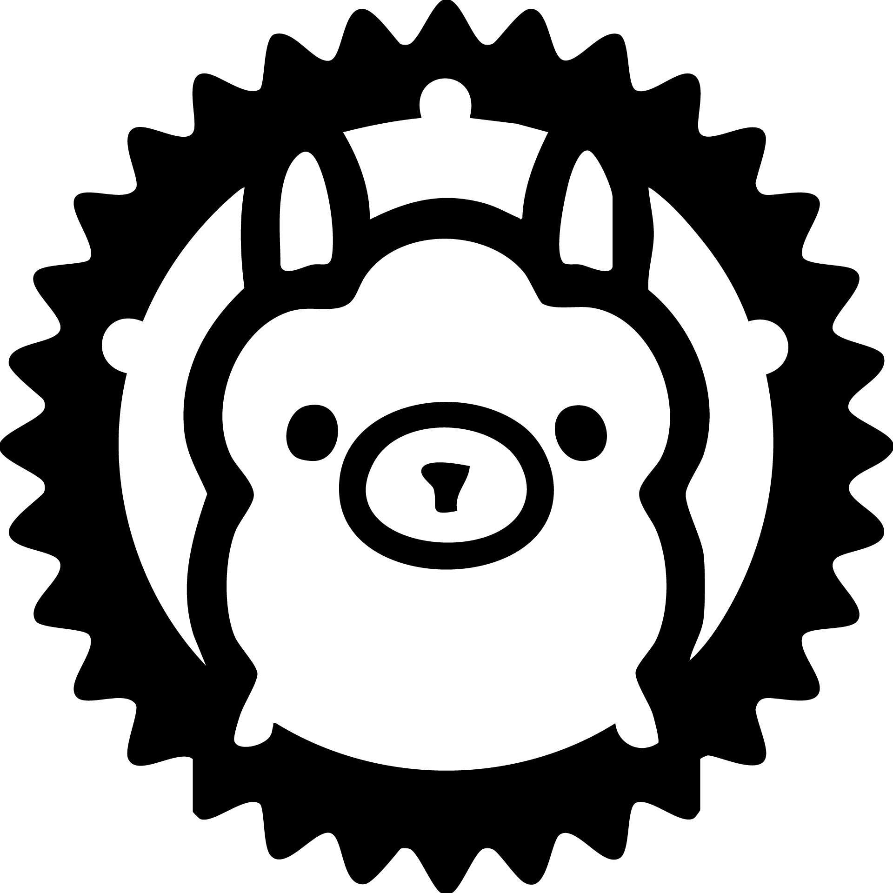

<!-- PROJECT LOGO -->
<br />
<div align="center">
  <a href="https://github.com/lowpolycat1/rusty_ollama_gui">
    
  </a>

<h3 align="center">Rusty Ollama GUI</h3>

  <p align="center">
    A GUI client for Ollama
    <br />
    <a href="https://github.com/lowpolycat1/rusty_ollama_gui"><strong>Explore the docs »</strong></a>
    <br />
    <br />
    <a href="https://github.com/LowPolyCat1/rusty_ollama_gui/issues/new?template=bug_report.md">Report Bug</a>
    ·
    <a href="https://github.com/LowPolyCat1/rusty_ollama_gui/issues/new?template=feature_request.md">Request Feature</a>
  </p>
</div>

<!-- TABLE OF CONTENTS -->
<details>
  <summary>Table of Contents</summary>
  <ol>
    <li><a href="#about-the-project">About The Project</a></li>
    <li><a href="#built-with">Built With</a></li>
    <li><a href="#getting-started">Getting Started</a>
      <ul>
        <li><a href="#prerequisites">Prerequisites</a></li>
        <li><a href="#installation">Installation</a></li>
      </ul>
    </li>
    <li><a href="#usage">Usage</a></li>
    <li><a href="#roadmap">Roadmap</a></li>
    <li><a href="#contributing">Contributing</a></li>
    <li><a href="#license">License</a></li>
    <li><a href="#contact">Contact</a></li>
    <li><a href="#acknowledgments">Acknowledgments</a></li>
  </ol>
</details>

<!-- ABOUT THE PROJECT -->
## About The Project

Rusty Ollama is a Rust client library for interacting with the Ollama API, providing both synchronous and streaming interfaces for working with large language models.

Features:

- Simple API for text generation
- Streaming responses for real-time processing
- Context management for conversation history
- Configurable request options
- Error handling for API interactions

<p align="right">(<a href="#readme-top">back to top</a>)</p>

### Built With

[![Rust][Rust-shield]][Rust-url]
[![Reqwest][Reqwest-shield]][Reqwest-url]
[![Tokio][Tokio-shield]][Tokio-url]
[![Serde][Serde-shield]][Serde-url]

<p align="right">(<a href="#readme-top">back to top</a>)</p>

<!-- GETTING STARTED -->
## Getting Started

### Prerequisites

- Rust 1.60+
- Cargo
- Ollama server running locally (default: <http://localhost:11434>)

### Installation

Add to your `Cargo.toml`:

```toml
git clone https://github.com/lowpolycat1/rusty_ollama_gui
cd rusty_ollama_gui
cargo build --release
```

</p>

<!-- USAGE EXAMPLES -->

<p align="right">(<a href="#readme-top">back to top</a>)</p>

<!-- ROADMAP -->
## Roadmap

// TODO

See the [open issues](https://github.com/lowpolycat1/rusty_ollama/issues) for full list of proposed features.

<p align="right">(<a href="#readme-top">back to top</a>)</p>

<!-- CONTRIBUTING -->
## Contributing

Contributions are what make the open source community such an amazing place to learn, inspire, and create. Any contributions you make are **greatly appreciated**.

If you have a suggestion that would make this better, please fork the repo and create a pull request. You can also simply open an issue with the tag "enhancement".
Don't forget to give the project a star! Thanks again!

1. Fork the Project
2. Create your Feature Branch (`git checkout -b feature/AmazingFeature`)
3. Commit your Changes (`git commit -m 'Add some AmazingFeature'`)
4. Push to the Branch (`git push origin feature/AmazingFeature`)
5. Open a Pull Request

<p align="right">(<a href="#readme-top">back to top</a>)</p>

### Top contributors

<a href="https://github.com/lowpolycat1/rusty_ollama/graphs/contributors">
  
</a>

<p align="right">(<a href="#readme-top">back to top</a>)</p>

<!-- LICENSE -->
## License

Distributed under the MIT License. See `LICENSE.txt` for more information.

<p align="right">(<a href="#readme-top">back to top</a>)</p>

<!-- CONTACT -->
## Contact

lowpolycat1 - @acrylic_spark (discord)

Project Link: [https://github.com/lowpolycat1/rusty_ollama](https://github.com/lowpolycat1/rusty_ollama)

<p align="right">(<a href="#readme-top">back to top</a>)</p>

<!-- ACKNOWLEDGMENTS -->
## Acknowledgments

- [Ollama](https://ollama.ai) for the AI platform
- [Reqwest](https://github.com/seanmonstar/reqwest) for HTTP client
- [Tokio](https://tokio.rs) for async runtime
- [Serde](https://serde.rs) for serialization

<p align="right">(<a href="#readme-top">back to top</a>)</p>

<!-- MARKDOWN LINKS & IMAGES -->
[Rust-shield]: https://img.shields.io/badge/Rust-000000?style=for-the-badge&logo=rust&logoColor=white
[Rust-url]: https://www.rust-lang.org/
[Reqwest-shield]: https://img.shields.io/badge/Reqwest-000000?style=for-the-badge&logo=reqwest&logoColor=white
[Reqwest-url]: https://docs.rs/reqwest/latest/reqwest/
[Tokio-shield]: https://img.shields.io/badge/Tokio-000000?style=for-the-badge&logo=tokio&logoColor=white
[Tokio-url]: https://tokio.rs/
[Serde-shield]: https://img.shields.io/badge/Serde-000000?style=for-the-badge&logo=serde&logoColor=white
[Serde-url]: https://serde.rs/
